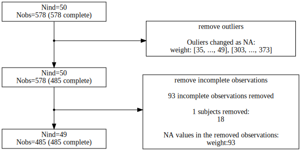

<!-- README.md is generated from README.Rmd. Please edit that file -->

```{r, include = FALSE}
knitr::opts_chunk$set(
  collapse = TRUE,
  comment = "#>",
  fig.path = "man/figures/README-",
  out.width = "100%"
)
```

```{r echo=FALSE, results='asis'}
# adding "IAMREADME" to environment so the vignette knows it is called as a children
IAMREADME <- NULL
cat(
  knitr::knit_child("vignettes/autoflowchart.Rmd", envir = environment(), quiet = TRUE)
)
```


```{r echo=FALSE}

```
