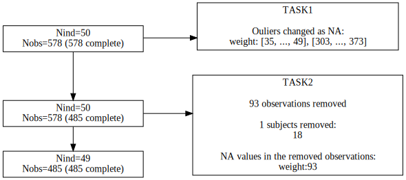

```{r, include = FALSE}
knitr::opts_chunk$set(
  collapse = TRUE,
  comment = "#>"
)
```

```{r setup, include = FALSE}
devtools::load_all()
```


`autoflowchart` is a R package to help you build flowcharts for data management or cohort follow up.


To use it, download this repo then use:
- install it using `devtools::install_github("https://github.com/FrankwaP/autoflowchart")`
- or clone this repo and use `devtool::load_all("LOCAL_PATH_TO_THE_REPO")` (easier to debug or add modifications).

It writes down a [Graphviz](https://graphviz.org/) .dot file and call Graphviz.
So it must be installed and the `dot` command must exist in your system's `PATH`.

It considers:
 - the main branch, for which summaries of the datasets at each step are displayed
 - the side nodes, for which summaries of the modifications at each step are displayed

The summaries are obtained using functions which:
 - return a string or `NULL`
 - uses specific arguments:
   - for the datasets summaries: `df` and optionally `subject` and `time`
   - for the modifications summaries: `df1`, `df2` and optionally `subject` and `time`

Some functions are already coded, but you can defined yours as long as they respect these constraints.

Here is a basic example:

```{r}
```


```{r}
# example of data-management ----

## original dataset ----
data0 <- ChickWeight

## removing "outliers" ----
data1 <- data0
idx <- (data1[["weight"]] < 50) | (data1[["weight"]] > 300)
data1[idx, "weight"] <- NA
# creating the task
task1 <- list_outliers_as_na

## remove incomplete observations ----
data2 <- data1
data2 <- data2[complete.cases(data2), ]
# creating the task
task2 <- combine_func(
  list_removed_observations,
  list_removed_subjects,
  count_na_removed_observations
)

## function to summarize the information of a dataset
summarize <- function(df) {
  n_ind <- length(unique(df$ID))
  n_row <- nrow(df)
  n_val <- sum(!is.na(df))
  output <- sprintf("Nind=%d\nNobs=%d\nNval=%d", n_ind, n_row, n_val)
  return(output)
}

# Generating the flowchart
make_flowchart(
  list_df = list(data0, data1, data2),
  list_summary_func = list(summarize, summarize, summarize),
  list_comparison_func = list(task1, task2),
  subject = "Chick",
  time = "Time",
  output_svg_file = "test-flowchart.svg"
)



```
